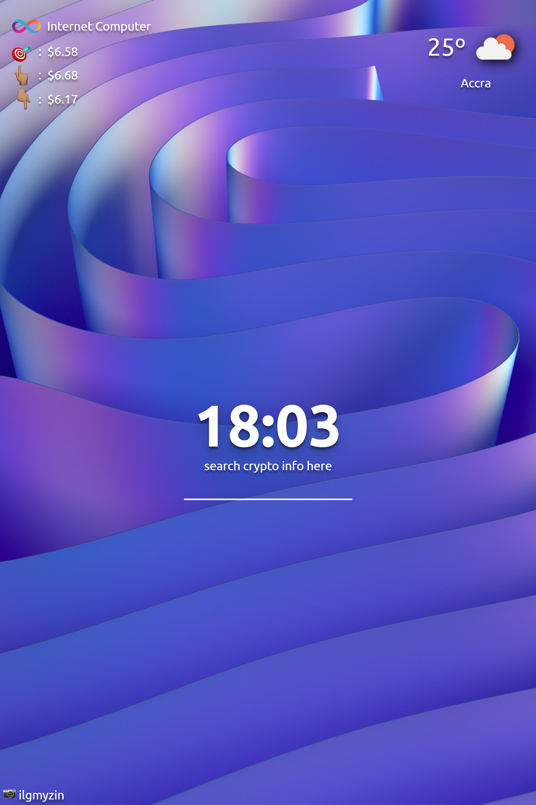

# Killy's Dashboard

> This is an app which is inspired by the momentum chrome extension. This gives you a more stylish look when installed into your browser. You get to change background image, which is fetched from the unsplash API. Also there is a live weather forecast which shows the weather in your current region. Weather information is fetched from open weather API and Finally there is a crypto market price reading from coingecko API. all these come together to make this momentum inspired chrome extension standout.

## Live Demo

[Live Demo Link](https://killy10o10.github.io/unsplash/)

## Built With

- HTML
- CSS
- JavaScript
- Rest API

## Author

👤 **Okine Kingsley**

- GitHub: [@killy10o10](https://github.com/killy10o10)
- Twitter: [@Quami_Killy](https://twitter.com/Quami_Killy)
- Instagram: [quami_killy](https://www.instagram.com/quami_killy/)

## 🤝 Contributing

Contributions, issues, and feature requests are welcome!

## Show your support

Give a ⭐️ if you like this project!

## Acknowledgments

- Hat tip to anyone who's code/resource was used
